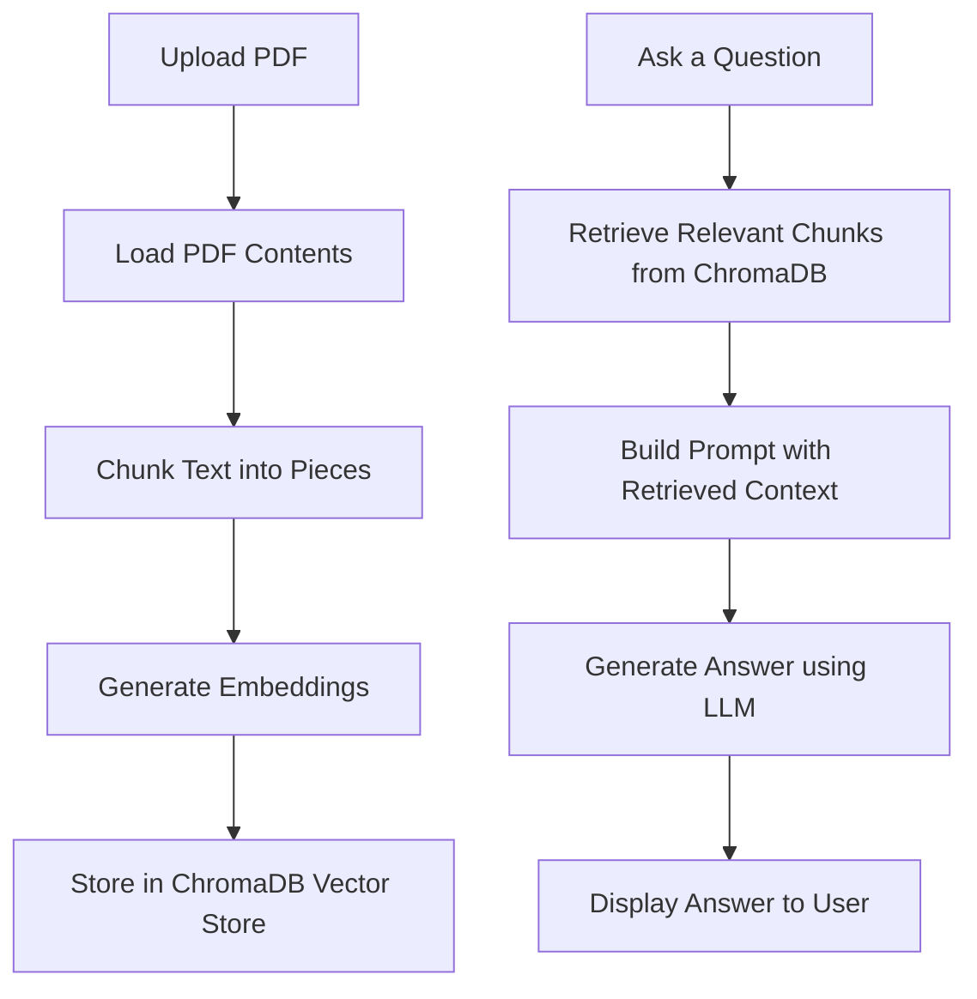

# Research-Paper-Copilot
LLMs, agents, RAG, embeddings, and real-world use.

A multi-agent system that lets you **upload a research paper (PDF)** and **ask questions** about it!  
Built with **Streamlit** for UI, **ChromaDB** for vector storage, and a modular **Agentic Architecture** for document understanding.

---

## Features
- Upload PDF research papers 
- Automatic PDF loading, text chunking, and embeddings generation
- Store embeddings in ChromaDB for fast retrieval
- Query over document content using LLM-based reasoning
- Modular agent system for easy extensions
- Clarification agent when no direct answer is found
- (Upcoming!) Extract research papers from web via APIs

---

## How It Works

1. **Upload a PDF** via the Streamlit app
2. **Extract text** using `pdf_loader_agent`
3. **Chunk the text** smartly for better embeddings
4. **Generate embeddings** using an embedding model
5. **Store in ChromaDB**
6. **Ask questions** — system retrieves top chunks relevant to your query (defaults to 5 for streamlit)
7. **Builds a prompt** with retrieved chunks
8. **Generates a response** using an LLM

### Flowchart
This uses [Mermaid](https://mermaid-js.github.io/mermaid/#/) diagrams


---

## Tech Stack

- **Python 3.12+**
- **Streamlit** (Frontend UI)
- **ChromaDB** (Vector database)
- **Langchain / Gemini** (for response generation)
- **Huggingface Sentence Transformers** (for embedding)
- Modular custom **Agents**

---

## Setup Instructions

1. **Clone the Repository**

```bash
git clone https://github.com/RishabhSpark/Research-Paper-Copilot.git
```

2. **Install dependencies with poetry**
Install poetry (if you don't have it already)
```bash
Install Poetry (if you don't have it already)
```

Install dependencies
```bash
poetry install
```

3. Run the app
- Using streamlit (for UI)
```bash
streamlit run app/ui/streamlit_ui.py
```

- (or) Using python
```bash
python main.py
```
